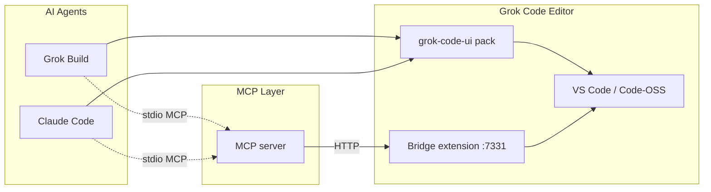

<div align="center">


# Grok Code

**AI-native code editor built on VS Code Open Source**

[](https://github.com/xrctz/grok-code/actions/workflows/test.yml)
[](LICENSE)
[](package.json)

A fully rebranded editor shell with embedded AI agents, an MCP bridge, and a one-word `grok` launcher.

[Quick Start](#quick-start) · [Features](#features) · [Architecture](#architecture) · [MCP Bridge](vscode-mcp/README.md) · [Contributing](CONTRIBUTING.md)

</div>

---

## Overview

**Grok Code** is a custom development environment forked from [Code - OSS](https://github.com/microsoft/vscode). It replaces the stock VS Code identity with a purpose-built shell designed for AI-assisted workflows — embedded agents, MCP tool integration, and a polished Grok-branded UI.

Talk to **Grok Build** (or optionally **Claude Code**) inside the editor. Agents drive the window through `vscode_*` MCP tools: open files, apply edits, run shell commands, and surface diagnostics.

## Features

| | |
| --- | --- |
| **Custom UI shell** | Grok Code Void theme, custom icons, Home Stage, hidden upstream chrome |
| **Embedded Grok Build** | Agent terminal opens on startup with `--always-approve` |
| **MCP bridge** | HTTP bridge on `:7331` exposes editor APIs to any MCP client |
| **Claude Code support** | Optional second agent terminal (manual launch only) |
| **One-word launcher** | Bare `grok` opens the editor + agent from anywhere |
| **Copilot-free** | AI control path is MCP-only — no GitHub Copilot dependency |

## Quick Start

### Prerequisites

- **Node.js 20+**
- **Windows, macOS, or Linux** (Ubuntu is the primary day-to-day target)
- **Grok CLI** at `~/.grok/bin/grok` (optional; for the embedded agent)
- **unzip** on Linux when bootstrapping the VS Code zip/tar (`sudo apt install unzip` if needed)

### Install & launch

```bash
git clone https://github.com/xrctz/grok-code.git
cd grok-code

npm run install:all    # install deps + build bridge/MCP
npm run ensure-binary  # download & brand VS Code for this OS (first run)
npm run launch -- .    # open Grok Code in current directory
```

**Ubuntu / Linux** (also works):

```bash
./launch.sh .
npm run install:shell   # installs bare `grok` + ~/.bashrc PATH + .desktop entry
source ~/.bashrc
```

**macOS**:

```bash
./launch.sh .
npm run install:shell   # installs bare `grok` + updates ~/.zshrc
source ~/.zshrc
```

**Windows** (PowerShell):

```powershell
npm run install:all
npm run ensure-binary
npm run launch -- .
# or:
.\launch.ps1 .
npm run install:shell   # writes %USERPROFILE%\.local\bin\grok.cmd — add that folder to PATH
```

All of `ensure-binary`, `launch`, and `install:shell` are **Node scripts**, so the same `npm run …` commands work on every OS.

### One-word launch: `grok`

```bash
npm run install:shell   # once (Ubuntu → ~/.bashrc, macOS → ~/.zshrc, Windows → grok.cmd)
# then reload your shell / PATH

grok                   # Grok Code + embedded Grok Build
grok "fix the tests"   # with an initial prompt
grok --standalone      # terminal-only Grok Build TUI
```

## Architecture



| Component | Path | Role |
| --- | --- | --- |
| UI pack | `vscode-mcp/grok-code-ui/` | Themes, Home Stage, agent terminals, layout |
| Bridge extension | `vscode-mcp/extension/` | HTTP API on `127.0.0.1:7331` |
| MCP server | `vscode-mcp/mcp-server/` | Translates MCP tools → bridge HTTP calls |
| Launcher | `scripts/launch-grok-code.mjs` | Binary bootstrap, VSIX install, profile seeding (Win/macOS/Linux) |
| Product source | `vscode-src/` | Code - OSS with Grok branding in `product.json` |

## Agent integration

### Grok Build (default)

On startup, the UI pack opens a **Grok Build** terminal wired to the MCP bridge. The agent can edit files, run commands, and control the window without interactive permission prompts.

- Status bar → **Grok Build**
- Home nav → **Grok** button
- Command palette → `Grok Code: Open Grok Build Terminal`

### Claude Code (optional)

A second agent terminal is available via button only — it never auto-boots.

- Command sidebar → **Open Claude Code**
- Home nav → **Claude** button
- Requires `ANTHROPIC_API_KEY` in your environment (see `launch-claude.sh`)

### Other agents (Codex, Gemini, OpenCode, Aider)

Grok Code is Grok-first but plays nice with other popular CLI coding agents.
Any that are installed on your machine are **detected automatically** and can be
opened in an integrated terminal — the Grok Code MCP bridge env is injected so
MCP-aware agents can drive the editor too.

- Home nav → **Agents** button, or Command sidebar → **AI Agents** list
- Command palette → `Grok Code: Open AI Agent…` (or a per-agent command)
- The bottom-bar list shows install status; not-installed agents show a copyable install command

| Agent | Binary | Install |
| --- | --- | --- |
| **Codex** (ChatGPT) | `codex` | `npm install -g @openai/codex` |
| **Gemini CLI** | `gemini` | `npm install -g @google/gemini-cli` |
| **OpenCode** | `opencode` | `npm install -g opencode-ai` |
| **Aider** | `aider` | `pipx install aider-chat` |

Override a binary path with the matching env var (`CODEX_BIN`, `GEMINI_BIN`,
`OPENCODE_BIN`, `AIDER_BIN`) if it lives somewhere unusual.

### MCP configuration

Print a ready-to-paste Grok MCP config:

```bash
npm run print-mcp-config
```

See **[vscode-mcp/README.md](vscode-mcp/README.md)** for the full tool reference.

## Project structure

```
.
├── launch.sh / launch.ps1 # thin launchers (Unix / Windows)
├── scripts/                  # cross-platform bootstrap, shell wrapper, smoke tests
│   └── lib/platform.mjs      # OS paths, VS Code download URLs, Electron flags
├── vscode-mcp/               # bridge · MCP server · UI pack
│   ├── extension/            # HTTP bridge :7331 (v0.1.5)
│   ├── grok-code-ui/         # themes + Home Stage (+ mascot) + multi-agent terminals (v0.7.0)
│   └── mcp-server/           # MCP tools for agents (v0.1.3)
└── vscode-src/               # Code - OSS (~1.129) + product.json rebrand
```

### Platform notes

| | Cache (branded binary) | User profile | Shell install |
| --- | --- | --- | --- |
| **Ubuntu / Linux** | `~/.local/share/grok-code` | `~/.grok-code-app` | `~/.local/bin/grok` + `.desktop` |
| **macOS** | `~/Library/Application Support/grok-code` | `~/.grok-code-app` | `~/.local/bin/grok` + `~/.zshrc` |
| **Windows** | `%LOCALAPPDATA%\grok-code` | `%USERPROFILE%\.grok-code-app` | `%USERPROFILE%\.local\bin\grok.cmd` |

Override with `GROK_CODE_CACHE`, `GROK_CODE_APP`, `GROK_CODE_USER_DATA`, or `CODE_BIN`.
Linux launches pass `--no-sandbox` (common on Ubuntu / containers); macOS and Windows do not.
## Configuration

| Variable | Default | Purpose |
| --- | --- | --- |
| `GROK_CODE_ROOT` | auto-detected | Path to this repo |
| `GROK_CODE_CACHE` | OS default (see table above) | Branded VS Code download/cache root |
| `GROK_CODE_USER_DATA` | `~/.grok-code-app` | Editor profile (settings + extensions) |
| `GROK_CODE_OPEN_AGENT` | `1` | Open Grok Build terminal on launch |
| `GROK_REAL_BIN` | `~/.grok/bin/grok` | Grok CLI binary path |
| `CODE_BIN` | auto | Override VS Code binary |
| `VSCODE_MCP_TOKEN` | from `.vscode-mcp.env` | Bridge auth token |
| `VSCODE_MCP_TIMEOUT_MS` | `60000` | MCP client per-request timeout (aborts a hung bridge) |

Copy `.vscode-mcp.env.example` → `.vscode-mcp.env` for local bridge settings.

## Development

```bash
npm run install:all   # install + build
npm test              # structural + MCP smoke tests
npm run package       # build VSIX extensions
npm run launch -- .   # launch Grok Code
```

### Smoke test without VS Code UI

```bash
# terminal 1 — mock bridge
cd vscode-mcp
VSCODE_MCP_TOKEN=dev-token-123 node scripts/mock-bridge.mjs

# terminal 2 — exercise MCP client
export VSCODE_MCP_TOKEN=dev-token-123
node -e "
import('./mcp-server/dist/client.js').then(async ({ BridgeClient, loadBridgeConfig }) => {
  const c = new BridgeClient(loadBridgeConfig());
  console.log(await c.health());
  console.log(await c.get('/status'));
});
"
```

### Building from source

Compiling Code - OSS end-to-end requires a multi-GB download and tens of minutes of compile time. The MCP bridge works with **any** VS Code binary — a from-source build is not required.

```bash
cd vscode-src && npm install && npm run compile
```

See [Microsoft's contribution guide](https://github.com/microsoft/vscode/wiki/How-to-Contribute) for details.

## No Copilot

GitHub Copilot is intentionally disabled:

- `vscode-src/product.json` — no Copilot trust / auto-update
- `scripts/launch-grok-code.mjs` — hard `--disable-extension` for Copilot IDs
- `scripts/default-user-settings.json` — completions and chat agents off

## License

- **Grok Code** (`vscode-mcp/`, `scripts/`): [MIT](LICENSE)
- **Code - OSS** (`vscode-src/`): [MIT](vscode-src/LICENSE.txt) (Microsoft / contributors)
